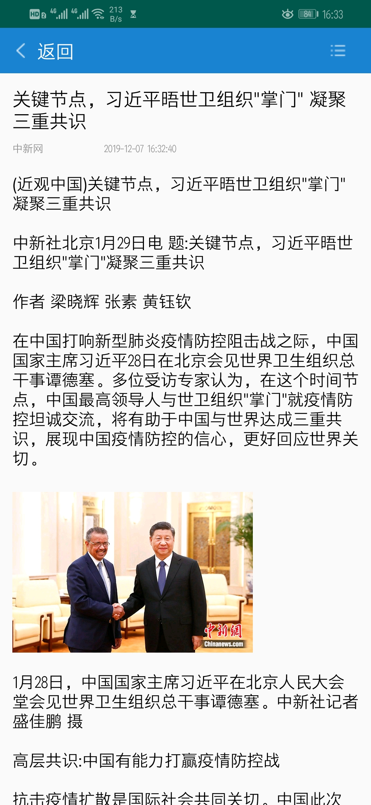

# News
该项目通过调用极速数据新闻API来实现阅读新闻这个功能

# 效果图

# 不足
1、新闻详细信息界面图片无法适应屏幕
2、视频无法播放
3、网络请求时有失败(失败原因不是新闻显示达到上限)

可能因为新闻内容是json数据的原因，以至于新闻内容难以实现适应手机屏幕，因此出现部分图片大小不一或图片无法加载的情况。网络请求用的是AsyncHttpClient，我也该换了，听师傅说，网络请求用retrofit访问就可以了，且最近也看了GitHub他人的项目，发现好些人都用了Rxjava、retrofit，然后发现自己都好low，不说了，改一下跑步App的bug上传一下。
